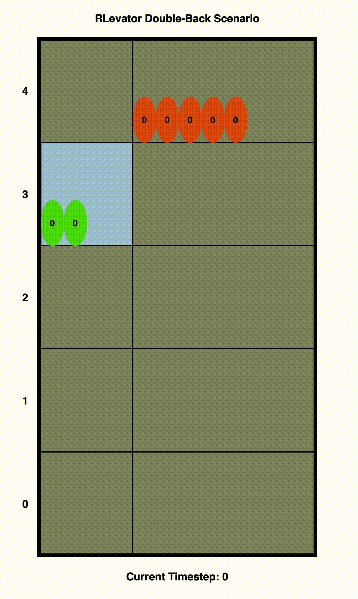
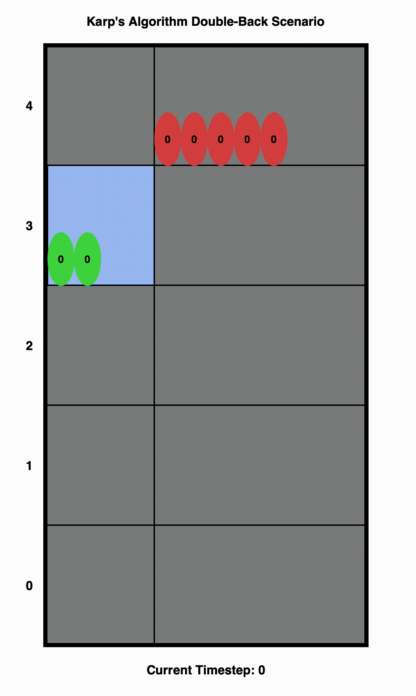

# RLevator

A dynamic elevator control algorithm trained using reinforcement learning.

<p float="left">
  
  
</p>

Created for the CS 229 Fall 2022 final project by Tejas Narayanan and Kiran Bhat.

## Installation instructions

RLevator was developed using Python 3.10. To install all dependencies, run `pip install -r requirements.txt`.

## Running RLevator

### Training an agent

To train an agent, run `python train_elevator_agent.py`. Argument details are as follows:
```
usage: train_elevator_agent.py [-h] [--num_floors_start NUM_FLOORS_START] [--num_floors_end NUM_FLOORS_END] [--timesteps TIMESTEPS] [--seed SEED] [--verbose VERBOSE]

options:
  -h, --help            show this help message and exit
  --num_floors_start NUM_FLOORS_START, -nfs NUM_FLOORS_START
                        Number of floors at start
  --num_floors_end NUM_FLOORS_END, -nfe NUM_FLOORS_END
                        Number of floors at end
  --timesteps TIMESTEPS, -t TIMESTEPS
                        Number of timesteps to train
  --seed SEED, -s SEED  Random seed to use
  --verbose VERBOSE, -v VERBOSE
                        Verbosity (0 or 1)
```

To monitor training progress, run `tensorboard --logdir tensorboard`.

When `num_floors_end` > `num_floors_start`, curriculum learning is applied to progressively increase the
complexity of the environment.

This program will train an agent and save it to a path corresponding to the environment parameters. This
path is printed at the beginning of training, and can be passed into the benchmarking script to evaluate
performance.

### Benchmarking agents

To compare the performance of trained agents to the standard elevator control algorithm,
run `python benchmark_agents.py -n NUM_FLOORS --models MODEL_1_PATH MODEL_2_PATH ...`.
Argument details are as follows:

```
usage: benchmark_agents.py [-h] [--num_floors NUM_FLOORS] --models MODELS [MODELS ...]

options:
  -h, --help            show this help message and exit
  --num_floors NUM_FLOORS, -n NUM_FLOORS
                        number of floors for environment
  --models MODELS [MODELS ...], -m MODELS [MODELS ...]
                        Paths to models to be evaluated. Example path: models/env_v7/elev1-1_floor3-3_rand1/dd23f6.zip
                        
```

This program will evaluate the models provided, along with the standard control algorithm, and provide
the mean and standard deviation of episodic rewards for each model.
